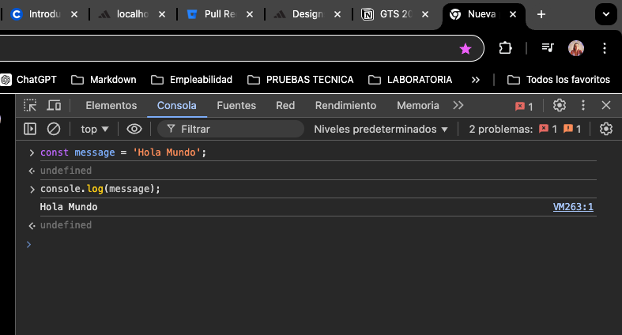
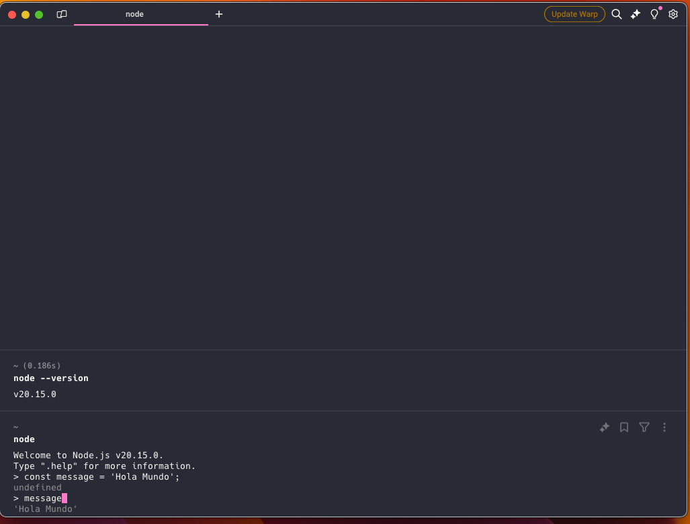

# NodeJS
Este es el desarrollo de los ejercicios propuestos en el curso NodeJS: De cero a experto de Fernando Herrera en Udemy.

## Hello World - En Node
* Como agregamos codigo de JS en la consola del navegador, en este caso Chrome
    
* Y como agregamos y ejecutamos codigo de JS con Node desde cualquier terminal (En este caso uso Warp, pero se puede usar git, powerShell, entre otros).
    
    Recordar que no tenemos la necesidad de agregar el console.log() para ver el resultado de la variable message.
Nota: para salirse de la terminal interactiva de Node en cualquier terminal Ctrl + C